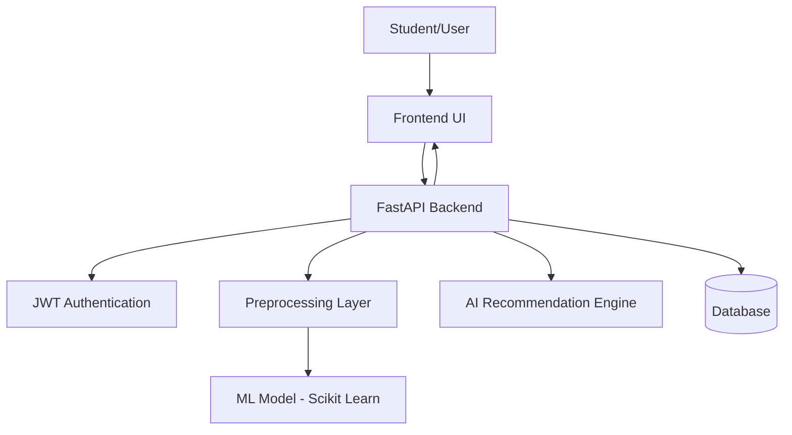

🚀 Autonomous Academic Intelligence System (AAIS)

An AI-powered system that predicts student burnout risk using behavioral and lifestyle signals.
Designed as a prototype intelligent academic monitoring assistant for early intervention and performance optimization.

🧠 Project Overview

The Autonomous Academic Intelligence System (AAIS) leverages machine learning to:

Detect early signs of student burnout

Analyze behavioral academic patterns

Generate predictive burnout risk scores

Enable proactive academic intervention

This project simulates real-world academic behavioral data and builds a complete ML pipeline from data generation to deployment-ready models.

🎯 Problem Statement

Student burnout is a growing issue in academic environments due to:

High stress levels

Excessive screen time

Poor sleep cycles

Declining mood patterns

Early prediction enables institutions to intervene before academic decline occurs.

🏗️ System Architecture

Synthetic Data Generator

Creates realistic student behavioral data

Models correlation between stress, sleep, mood, screen time

Produces labeled burnout risk dataset

Data Preprocessing

Feature scaling

Train-test split

Class balance verification

Baseline Model

Logistic Regression classifier

Performance evaluation (Accuracy, Precision, Recall, F1)

Advanced Models (Planned)

Random Forest

Gradient Boosting

Neural Network classifier

📊 Features Used
Feature	Description
study_hours	Daily academic workload
sleep_hours	Average sleep duration
stress_level	Self-reported stress (1–10)
screen_time	Daily digital usage
mood_score	Emotional stability score
attendance	Class participation rate
assignment_completion	Academic consistency
physical_activity	Daily exercise hours

Target Variable:

burnout_risk (0 = Low, 1 = High)
📈 Sample Model Performance

Accuracy: ~98–99%

Balanced Class Distribution

Optimized threshold-based classification

🛠️ Tech Stack

Python

NumPy

Pandas

Scikit-Learn

Matplotlib

Joblib
## 🏗 System Architecture

## 🏗 System Architecture

